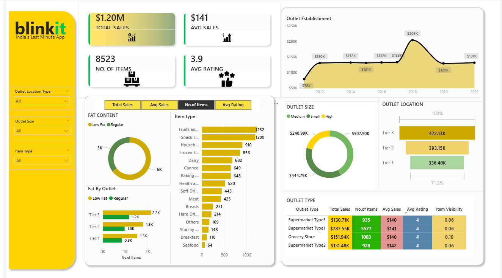

# Blinkit Sales Dashboard | Power BI

## Project Overview
This project is an interactive Power BI dashboard developed to analyze Blinkit's sales performance, outlet trends, customer ratings, and product insights using dynamic visualizations and KPIs.

## Tools Used
- Power BI
- Microsoft Excel
- Data Cleaning
- Data Visualization

## Features
- Sales Performance Analysis
- Outlet-wise Sales Tracking
- Product Category Analysis
- Fat Content Distribution
- Customer Rating Insights
- Interactive Filters and Slicers

## KPIs Included
- Total Sales
- Average Sales
- Average Rating
- Total Items Sold

## Business Insights
- Tier 3 outlets generated strong sales performance
- Supermarket Type1 outlets contributed the highest sales
- Regular fat products showed higher customer preference
- Snack Foods and Fruits categories recorded consistent demand

## Dashboard Preview

## Project Outcome
The dashboard provides meaningful business insights by identifying sales trends, customer preferences, and outlet performance, helping support data-driven decision-making.
